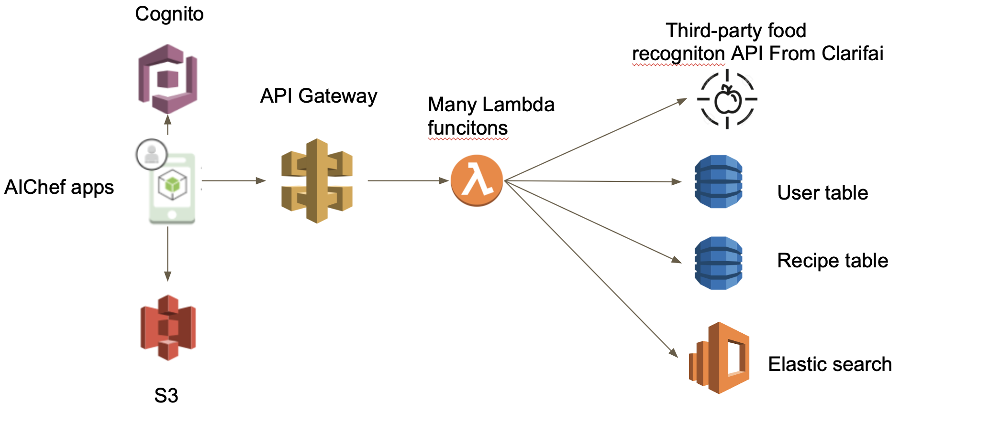

# AIChef

##### Abstract

AIChef is a recipe-searching app that can help users to find the recipes according to the ingredients you have. The app can recognize the ingredients the users have through a photo and search for the desired recipes in the database. Users can also add recipes to their favourites and manage their favourite recipes. The 10 latest search histories are also saved and accessible by the user.

##### Design

The application uses a serverless design. There is no central server that is actively running for the backend. Instead, as shown in the [api design](API_design.jpg), the frontend communicates with the backends solely through APIGateway, except for authentication with AWS Cognito and uploading photos to S3 buckets. The communications between the frontend and backend AWS services are accomplished using Amplify Framework and AWS Android SDK. All the API calls and functionalities are implemented in lambda functions. The lambda functions are responsible for coordinating other backend resources such as the databases, Elastic search, Clarifai, etc., to fulfill the frontend’s requests and return the result to the frontend in JSON format.

##### Functionalities

In order to use the app, users must sign in. The authentication process is handled by AWS Cognito. Cognito manages the users’ profiles as well as enables users to sign in through external federated identity providers, Google and Facebook. After signing in, there are three different flows for getting recipes:

- Take a photo of the ingredients. Select wanted recognized ingredients. Add additional ingredients. Search recipe with the ingredients. In the result-display interface, users can click on a recipe to view the detailed steps or add searched recipes to favourite recipes to revisit them later.
- From the search history activity, users can click on each search history. This will bring up a new search window. There, users can add new ingredients or delete previous ingredients and redo the search. The result will be displayed in the same result-display interface mentioned above.
- From the favourite recipes, users can click on a recipe to view the detailed steps of that recipe.

##### Architecture

##### Demo

https://youtu.be/gvp55uJNOP4

APK

